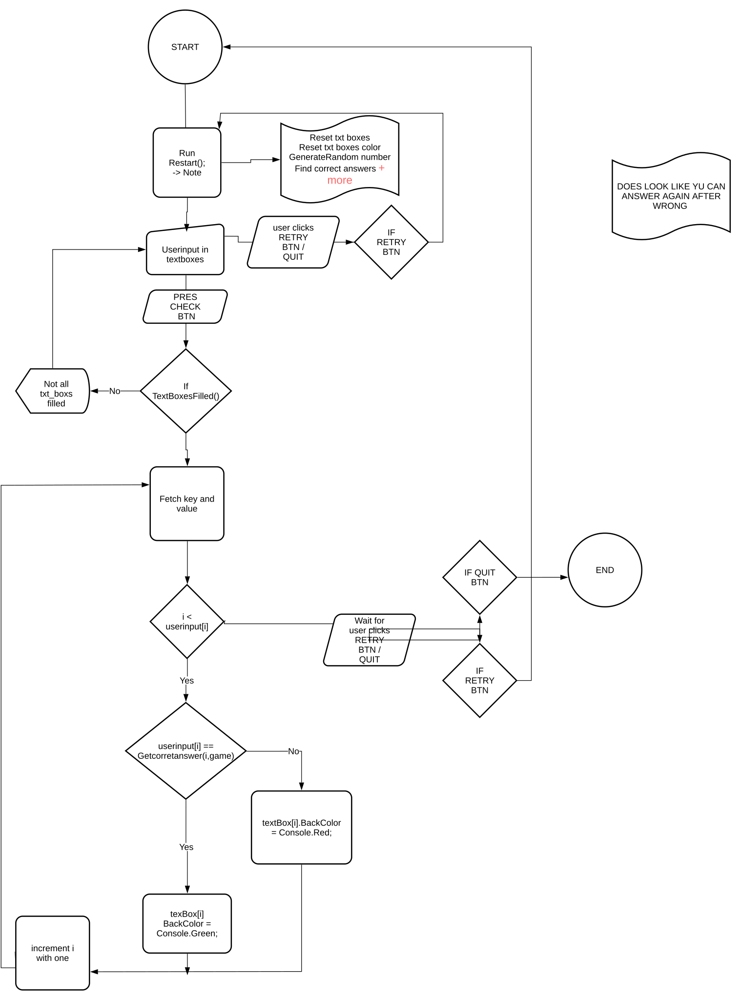

# 🎮 Børne Spil - Tal Udfordringsspil

## 📝 Oversigt
🎮👶**Børne Spil** er en Windows Forms-applikation, der opfordrer børn til at øve matematik ved at løse simple taludfordringer. Spillet præsenterer et tilfældigt tal og kræver, at spillerne beregner og indtaster fire svar relateret til dette tal. Det giver realtidsfeedback om brugernes inputnøjagtighed ➕🕹️.

## ✨ Funktioner
- 🎲 Genererer et tilfældigt tal mellem 11 og 89.
- 🧮 Beder brugerne om at løse grundlæggende matematiske problemer relateret til det genererede tal.
- ✅ Giver øjeblikkelig feedback med farvekodede svar (grøn for korrekt, rød for forkert).
- 🛡️ Brugervenlig grænseflade med inputvalidering, der sikrer, at kun numeriske indtastninger er tilladt.
- 🔄 Mulighed for at genstarte spillet for kontinuerlig træning.

## 🔢 Opretter tilfældigt tal og sætter svarmuligheder
- Når applikationen starter, genereres et tilfældigt tal mellem 11 og 89. Spillet giver fire opgaver, hvor spilleren skal indtaste svar i tekstfelter. Korrekte svar oprettes baseret på det tilfældige tal:
- Random_Number: Dette tilfældige tal bruges til at generere de korrekte svar.
- Correct_answerboxX: Hver variabel repræsenterer et korrekt svar baseret på det tilfældige tal.
```csharp

Random rand1 = new Random();
Random_Number = rand1.Next(11, 89);  // Genererer et tilfældigt tal
stxNumber.Text = Convert.ToString(Random_Number);  // Viser det i grænsefladen

// Sætter de korrekte svar baseret på det tilfældige tal
Correct_answerbox1 = Random_Number + 10;
Correct_answerbox2 = Random_Number + 1;
Correct_answerbox3 = Random_Number - 10;
Correct_answerbox4 = Random_Number - 1;

```
## 🖊️ Brugeren indtaster svar i tekstfelte
- Brugeren indtaster deres svar i fire tekstfelter. For hvert felt bliver input valideret, så kun tal er tilladt:
- KeyPress: Sørger for, at brugeren kun kan indtaste numeriske værdier.
```csharp
private void textBox1_KeyPress(object sender, KeyPressEventArgs e)
{
    e.Handled = !char.IsControl(e.KeyChar) && !char.IsNumber(e.KeyChar); // Kun tal er tilladt
}
```
## ✅ Tjekker om svarene er korrekte
- Når brugeren klikker på knappen for at indsende sine svar, tjekker programmet, om de indtastede værdier stemmer overens med de korrekte svar:
- CheckAnswer: Funktion, der sammenligner brugerens input med de korrekte svar og farvekoder felterne (grøn = korrekt, rød = forkert).
 ```csharp
private void CheckAnswer()
{
    int UserInput_TextBox1 = Convert.ToInt16(textBox1.Text);
    int UserInput_TextBox2 = Convert.ToInt16(textBox2.Text);
    int UserInput_TextBox3 = Convert.ToInt16(textBox3.Text);
    int UserInput_TextBox4 = Convert.ToInt16(textBox4.Text);

    if(UserInput_TextBox1 == Correct_answerbox1) { textBox1.BackColor = Color.LightGreen; }
    else { textBox1.BackColor = Color.Red; }

    if (UserInput_TextBox2 == Correct_answerbox2) { textBox2.BackColor = Color.LightGreen; }
    else { textBox2.BackColor = Color.Red; }

    if (UserInput_TextBox3 == Correct_answerbox3) { textBox3.BackColor = Color.LightGreen; }
    else { textBox3.BackColor = Color.Red; }

    if (UserInput_TextBox4 == Correct_answerbox4) { textBox4.BackColor = Color.LightGreen; }
    else { textBox4.BackColor = Color.Red; }
}

```
## 🔄 Genstart spillet
- Efter at have svaret på opgaverne, kan brugeren vælge at genstarte spillet, hvilket rydder tekstfelterne og genererer et nyt tilfældigt tal:
- Restart: Funktion der nulstiller tekstfelterne og sætter grænsefladen tilbage til starttilstand.
 ```csharp
textBox1.Text = "";
    textBox2.Text = "";
    textBox3.Text = "";
    textBox4.Text = "";

    textBox1.BackColor = Color.White;
    textBox2.BackColor = Color.White;
    textBox3.BackColor = Color.White;
    textBox4.BackColor = Color.White;

    RND(); // Genererer nyt tilfældigt tal
```
## 🎨 Feedback til spilleren
- Farvekoderne i tekstfelterne er en vigtig del af spillet, da de giver øjeblikkelig feedback til brugeren. Når brugeren har indtastet deres svar og trykket på knappen, får de visuel feedback, så de kan se, hvor de har svaret korrekt eller forkert.





## 🙌 Tak for din tid!

Jeg håber, du fandt denne gennemgang nyttig! Hvis du er interesseret i at se flere af mine projekter, kan du tjekke dem ud [here](https://github.com/PlutoGamerpro?tab=stars).


