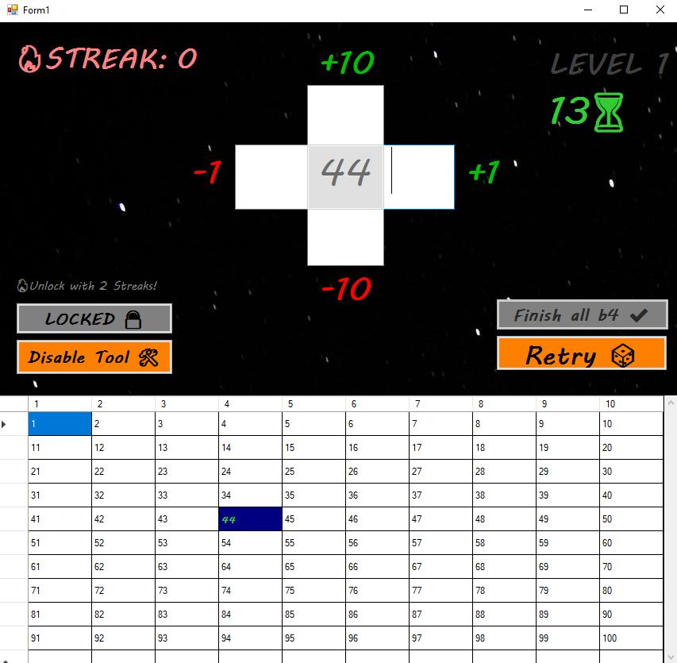
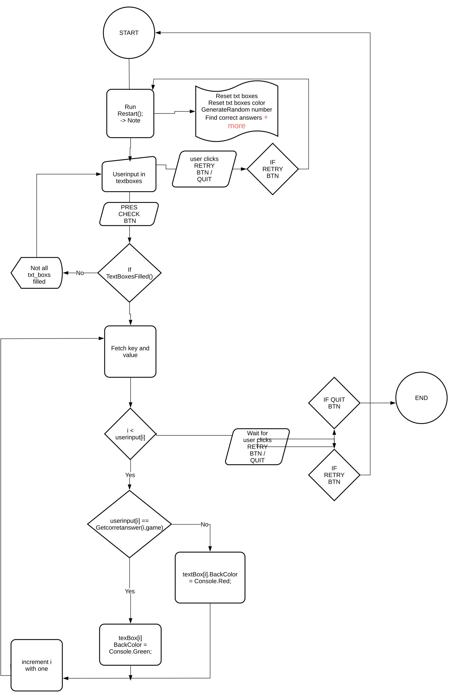

# 🎮 Børne Spil - Tal Udfordringsspil

Velkommen til Hundredetal Spillet! 🎉 Dette er et interaktivt program, hvor du skal finde tal, der relaterer sig til et tilfældigt valgt hundredetal. 🤔✨

## ✨ Functions
1. ✨ [Funktioner](#-funktioner)


## 📊 UI / Diagrammer
 1. 📊 [Flowchart Beskrivelse for "Børne Spil"](#-flowchart-beskrivelse-for-børne-spil)
 2. 🎨 [UI GAME](#-ui-game) 

## 🧩 Metoder PART 1
1. 🖱️  [Button_MouseDown](#-button_mousedown) 
2. ⏳  [StartCountdown](#-startcountdown)  
3. ✅  [CHECKSUBMIT](#-checksubmit) 
4. 🔄  [StartContinuousUpdate](#-startcontinuousupdate)
5. 🔄  [RestartCountdown](#-restartcountdown)
6. 🔄  [Restart](#-restart)
7. 🎨  [ResetTextBoxColors](#-resettextboxcolors)
8. 📋  [button1_Click](#-button1-click)

## 🧩 Metoder PART 2
1. 🌟 [IncrementSteakText_Display](#-incrementsteaktext_display)
2. 🔄 [AreAllTextBoxesFilled](#-arealltextboxesfilled)
3. 🔄 [RETRY_BTN_Click](#-retry_btn_click)
4. 🔢 [TextBox_KeyPress](#-textbox_keypress)
5. 📊 [PopulateTaloversigt](#-populatetaloversigt)
6. 🔄 [Enable_Disable_HELP_TOOL_Click](#-enable_disable_help_tool_click)
7. ⏲️ [Timer8_Tick](#-timer8_tick) 
   
  
  
## 📝 Oversigt

🎮👶 **Børne Spil** er en Windows Forms-applikation, der opfordrer børn til at øve matematik ved at løse simple taludfordringer. 🧠💡 Spillet præsenterer et tilfældigt tal og kræver, at spillerne beregner og indtaster fire svar relateret til dette tal:

- ➕ 10 større end det valgte tal
- ➖ 10 mindre end det valgte tal
- ➕ 1 større end det valgte tal
- ➖ 1 mindre end det valgte tal

Spillet giver realtidsfeedback om brugernes inputnøjagtighed, så alle kan lære og forbedre sig! 📈👍🎊

Fejl: Kunne ikke behandle filen ```..\Views\Form1.resx, da den er i Internet- eller Begrænset zone eller har markeringen fra internettet.```

For at løse dette problem, følg disse trin:

1. 🖱️ Højreklik på **Form1.resx** filen i Stifinder.
2. 📄 Vælg **Egenskaber** fra kontekstmenuen.
3. 🔒 Kig efter **Fjern blokering** afkrydsningsfeltet nederst i Egenskabsvinduet.
4. ✅ Hvis **Fjern blokering** muligheden er tilgængelig, skal du markere boksen og klikke **OK**.
5. 📂 Hvis **Fjern blokering** ikke er synligt, kan du prøve at flytte filen til en anden mappe (som din Skrivebord) og derefter tilbage til dens oprindelige placering.
6. 🔄 Genåbn Visual Studio og genopbyg dit projekt.

Dette fjerner markeringen fra internettet fra filen, så den kan behandles korrekt. 🚀

## 🎨 UI GAME




## ✨ Funktioner
- 🎲 Genererer et tilfældigt tal mellem 11 og 89.
- 🧮 Beder brugerne om at løse grundlæggende matematiske problemer relateret til det genererede tal.
- ✅ Giver øjeblikkelig feedback med farvekodede svar (grøn for korrekt, rød for forkert).
- 🛡️ Brugervenlig grænseflade med inputvalidering, der sikrer, at kun numeriske indtastninger er tilladt.
- 🔄 Mulighed for at genstarte spillet for kontinuerlig træning.

## 🔢 Opretter tilfældigt tal og sætter svarmuligheder
- Når applikationen starter, genereres et tilfældigt tal mellem 11 og 89. Spillet giver fire opgaver, hvor spilleren skal indtaste svar i tekstfelter. Korrekte svar oprettes baseret på det tilfældige tal:
- Random_Number: Dette tilfældige tal bruges til at generere de korrekte svar.
- Correct_answerboxX: Hver variabel repræsenterer et korrekt svar baseret på det tilfældige tal.
```csharp

Random rand1 = new Random();
Random_Number = rand1.Next(11, 89);  // Genererer et tilfældigt tal
stxNumber.Text = Convert.ToString(Random_Number);  // Viser det i grænsefladen

// Sætter de korrekte svar baseret på det tilfældige tal
Correct_answerbox1 = Random_Number + 10;
Correct_answerbox2 = Random_Number + 1;
Correct_answerbox3 = Random_Number - 10;
Correct_answerbox4 = Random_Number - 1;

```
<h2 id="button_mousedown">🖱️ Button_MouseDown</h2>
 - Description:
Handles the MouseDown event for buttons. When a button is pressed, it reduces its size slightly, providing visual feedback.
```csharp
private void Button_MouseDown(object sender, MouseEventArgs e)
{
    if (sender is Button button)
    {
        button.Size = new Size(button.Width - 5, button.Height - 5); // Make the button smaller
    }
}
```
## ⏳ StartCountdown
- Initializes the countdown timer to 20 seconds and updates the UI to display the starting time with an hourglass emoji.
 ```csharp
private void StartCountdown()
{
    countdownTime = 20; // Example: 20 seconds
    LABEL_COUNTDOWN.Text = countdownTime.ToString() + "⏳";
}
```


## ✅ CHECKSUBMIT
- Checks if all input text boxes are filled. If they are, enables the button to check answers and updates its appearance.
 ```csharp
  private void CHECKSUBMIT()
{
    if (AreAllTextBoxesFilled())
    {
        Invoke((MethodInvoker)(() =>
        {
            button1.Enabled = true;
            button1.BackColor = Color.LimeGreen;
            button1.Text = "Check answers ✔️";
        }));
    }
}
```


## 🔄 StartContinuousUpdate
- Starts an asynchronous continuous update loop that checks if all text boxes are filled every 16 milliseconds, simulating a frame rate of approximately 60 FPS
 ```csharp
private async void StartContinuousUpdate()
{
    _cts = new CancellationTokenSource();
    await Task.Run(() =>
    {
        while (!_cts.Token.IsCancellationRequested)
        {
            CHECKSUBMIT();
            Thread.Sleep(16); // ~60 FPS
        }
    });
}
 
  ```
  
## 🔄 RestartCountdown
-  Restarts the countdown timer, resetting it to 20 seconds and updating the displayed countdown time in the UI.
 ```csharp
  private void RestartCountdown()
{
    timer8.Start(); // Start the timer again
    countdownTime = 20; // Reset countdown time
    LABEL_COUNTDOWN.Text = countdownTime.ToString() + "⏳"; // Update the UI
}
```

## 🔄 Restart
- Resets the game state, clearing text boxes and resetting colors. Generates a new random number and updates the UI accordingly.
 ```csharp
private void Restart()
{
    panel1.Visible = false;
    button2.Visible = false;
    button4.Visible = false;

    textBox1.Text = "";
    textBox2.Text = "";
    textBox3.Text = "";
    textBox4.Text = "";

    ResetTextBoxColors();
    game.GenerateRandomNumber();
    RandomNumHighligt = game.RandomNumber;
    RestartCountdown();

    stxNumber.Text = game.RandomNumber.ToString();
    PopulateTaloversigt();
    CHECKButtonState();
}

```
## 🎨 ResetTextBoxColors
-  Resets the background colors of the input text boxes to white and the countdown label to a green color
 ```csharp
private void ResetTextBoxColors()
{
    textBox1.BackColor = Color.White;
    textBox2.BackColor = Color.White;
    textBox3.BackColor = Color.White;
    textBox4.BackColor = Color.White;

    LABEL_COUNTDOWN.ForeColor = Color.LimeGreen;
}
```


## 📋 button1_Click ✅
 - Handles the click event for the check answers button. Retrieves user inputs, checks them against correct answers, and updates the UI if all answers are correct.
```csharp
private void button1_Click(object sender, EventArgs e)
{
    int[] userInputs = new int[]
    {
        Convert.ToInt32(textBox1.Text),
        Convert.ToInt32(textBox2.Text),
        Convert.ToInt32(textBox3.Text),
        Convert.ToInt32(textBox4.Text)
    };

    answerChecker.CheckAnswers(userInputs, game, new TextBox[] { textBox1, textBox2, textBox3, textBox4 });

    if (AnswerChecker.AllAnswersCorrect)
    {
        timer8.Stop();
        IncrementSteakText_Display();
        label9.Text = "Congrats! You beat the clock and won!";
        button2.Visible = true;
        button4.Visible = true;
        panel1.Visible = true;
    }
}
```

## 🌟 IncrementSteakText_Display
- Increments the player's streak score each time they succeed and updates the displayed score on the UI.
```csharp
- private void IncrementSteakText_Display()
{
    AnswerChecker.StreakScore++;
    STEAKTEXT.Text = AnswerChecker.StreakScore.ToString();
}
```
## 🔄 ResetSteakTest_Display
- Resets the player's streak score to zero and updates the UI to reflect this change.
 ```csharp
private void ResetSteakTest_Display()
{
    AnswerChecker.StreakScore = 0;
    STEAKTEXT.Text = AnswerChecker.StreakScore.ToString();
}

```


## ✔️ AreAllTextBoxesFilled
-  Checks if all text boxes are filled with input. Returns true if all are filled; otherwise, returns false.
 ```csharp
private bool AreAllTextBoxesFilled()
{
    return !string.IsNullOrEmpty(textBox1.Text) &&
           !string.IsNullOrEmpty(textBox2.Text) &&
           !string.IsNullOrEmpty(textBox3.Text) &&
           !string.IsNullOrEmpty(textBox4.Text);
}

```

## 🔄 RETRY_BTN_Click
- Handles the click event for the retry button. Restarts the game by calling the Restart method.
 ```csharp
private void RETRY_BTN_Click(object sender, EventArgs e)
{
    Restart();
}
```

## 🔢 TextBox_KeyPress
- Restricts input in the text boxes to numeric characters only, handling and ignoring non-numeric input.
 ```csharp
  - private void TextBox_KeyPress(object sender, KeyPressEventArgs e)
{
    e.Handled = !char.IsControl(e.KeyChar) && !char.IsNumber(e.KeyChar);
}
```

## 📊 PopulateTaloversigt
-  Populates a helper tool matrix with numbers, dynamically creating rows and columns while highlighting a specific cell based on a random number.
 ```csharp
  private void PopulateTaloversigt()
{
    int totalColumns = 10;
    int totalRows = 10;
    int number = 1;

    Helping_Tool_mat.Rows.Clear();
    Helping_Tool_mat.Columns.Clear();

    int maxTotalWidth = 800; // Maximum width in pixels
    int columnWidth = maxTotalWidth / totalColumns; // Calculate width per column

    for (int col = 0; col < totalColumns; col++)
    {
        Helping_Tool_mat.Columns.Add("col" + col, (col + 1).ToString());
        Helping_Tool_mat.Columns[col].Width = columnWidth; // Set the calculated width for each column
    }

    Helping_Tool_mat.RowTemplate.Height = 30; // Set fixed row height

    for (int row = 0; row < totalRows; row++)
    {
        Helping_Tool_mat.Rows.Add(); // Add a new row
        for (int col = 0; col < totalColumns; col++)
        {
            Helping_Tool_mat.Rows[row].Cells[col].Value = number;

            if (number == RandomNumHighligt)
            {
                Helping_Tool_mat.Rows[row].Cells[col].Style.Font = new Font("MV Boli", 8.25F, FontStyle.Bold);
                Helping_Tool_mat.Rows[row].Cells[col].Style.BackColor = Color.Navy; // Highlight the cell
                Helping_Tool_mat.Rows[row].Cells[col].Style.ForeColor = Color.LimeGreen; // Highlight the cell
            }

            number++;
        }
    }
}
```

## 🔄 Enable_Disable_HELP_TOOL_Click
-  Toggles the visibility of the helper tool matrix when the corresponding button is clicked and updates the button text.
 ```csharp
private void Enable_Disable_HELP_TOOL_Click(object sender, EventArgs e)
{
    Helping_Tool_mat.Visible = !Helping_Tool_mat.Visible;
    Enable_Disable_HELP_TOOL.Text = Helping_Tool_mat.Visible ? "Disable Tool 🛠" : "Enable Tool 🛠️";
}
```

## ⏲️ Timer8_Tick
- Handles the countdown timer's tick event. Updates the countdown label and stops the timer when it reaches zero, displaying a message to the user.
 ```csharp
- private void timer8_Tick(object sender, EventArgs e)
{
    if (countdownTime > 0)
    {
        LABEL_COUNTDOWN.Text = countdownTime.ToString() + "⏳"; // Update the TextBox

        LABEL_COUNTDOWN.ForeColor = countdownTime <= 9 ? Color.Red : Color.LimeGreen; // Set colors based on countdownTime
        countdownTime--; // Decrement the countdown time
    }
    else
    {
        timer8.Stop(); // Stop the timer
        label9.Text = "Time's up! Unfortunately, you couldn't finish in time. But don't worry—every challenge is a chance to improve. Get ready for your next attempt!";
        LABEL_COUNTDOWN.Text = "0⏳";

        button2.Visible = true;
        button4.Visible = true;
        panel1.Visible = true;

        AnswerChecker.StreakScore = 0;
        ResetSteakTest_Display();
    }
}
```
  
## 🖊️ Brugeren indtaster svar i tekstfelte
- Brugeren indtaster deres svar i fire tekstfelter. For hvert felt bliver input valideret, så kun tal er tilladt:
- KeyPress: Sørger for, at brugeren kun kan indtaste numeriske værdier.
```csharp
private void textBox1_KeyPress(object sender, KeyPressEventArgs e)
{
    e.Handled = !char.IsControl(e.KeyChar) && !char.IsNumber(e.KeyChar); // Kun tal er tilladt
}
```

## ✅ Tjekker om svarene er korrekte
- Når brugeren klikker på knappen for at indsende sine svar, tjekker programmet, om de indtastede værdier stemmer overens med de korrekte svar:
- CheckAnswer: Funktion, der sammenligner brugerens input med de korrekte svar og farvekoder felterne (grøn = korrekt, rød = forkert).


## 🎨 Feedback til spilleren
- Farvekoderne i tekstfelterne er en vigtig del af spillet, da de giver øjeblikkelig feedback til brugeren. Når brugeren har indtastet deres svar og trykket på knappen, får de visuel feedback, så de kan se, hvor de har svaret korrekt eller forkert.


## 🎮 Flowchart Beskrivelse for "Børne Spil"



### 🖥️ Start
Spillet starter, når applikationen åbnes. 

### ⚙️ Initialiser Form
`Form1` opretter instanser af `Game` og `AnswerChecker`. 

### 🔄 Genstart Spil
Når spillet genstartes:
- 🔄`Restart()` kaldes for at nulstille spillet.
- 🗑️ Tekstbokse tømmes, og baggrundsfarver resettes.
- 🎲 Et tilfældigt tal genereres og vises til spilleren.

### ✍️ Brugerinput
Brugeren indtaster svar i fire tekstbokse. 

### ✅ Tjek Svar (Knappen)
Når brugeren klikker på "Submit":
- 📊 Indtastningerne konverteres til en int-array.
- `CheckAnswers()` kaldes for at evaluere svarene.
- Baggrundsfarverne opdateres:
  - 💚 Lysegrøn for korrekte svar.
  - ❤️ Rød for forkerte svar.

### 🔄 Forsøg Igen
Brugeren kan klikke på "Retry" for at genstarte spillet og prøve igen. 

### 🔢 Input Validering
Kun numerisk input er tilladt i tekstboksene for at sikre korrekt indtastning. 

### ❌ Slut 
Spillet fortsætter, indtil brugeren vælger at lukke applikationen. 

## 🛠️ Hjælpeværktøj til Tal Udfordringer
- Dette er et hjælpeværktøj, der viser nogle af de rigtige tal i Hundredetal Spillet. 🎯 Værktøjet hjælper brugerne med at forstå og finde korrekte svar i matematikopgaver ved at præsentere tal i et struktureret format

## 📊 Taloversigt

## - 🎲  Random Number picked is: $${\color{lightgreen}{42}}$$

|  1 |  2 |  3 |  4 |  5 |  6 |  7 |  8 |  9 | 10 |
|---|---|---|---|---|---|---|---|---|---|
| 11 | 12 | 13 | 14 | 15 | 16 | 17 | 18 | 19 | 20 |
| 21 | 22 | 23 | 24 | 25 | 26 | 27 | 28 | 29 | 30 |
| 31 | 32 | 33| 34 | 35 | 36 | 37 | 38 | 39 | 40 |
| 41 | $${\color{lightgreen}{42}}$$  |43  | 44 | 45 | 46 | 47 | 48 | 49 | 50 |
| 51 | 52 | _53_ | 54 | 55 | 56 | 57 | 58 | 59 | 60 |
| 61 | 62 | 63 | 64 | 65 | 66 | 67 | 68 | 69 | 70 |
| 71 | 72 | 73 | 74 | 75 | 76 | 77 | 78 | 79 | 80 |
| 81 | 82 | 83 | 84 | 85 | 86 | 87 | 88 | 89 | 90 |
| 91 | 92 | 93 | 94 | 95 | 96 | 97 | 98 | 99 | 100 |
 
- Korrekt svar: $${\color{lightgreen}{42}}$$


- Dette værktøj hjælper brugerne med at se og identificere de tal, de skal arbejde med, og understøtter dem i deres matematiske læring. 🎉

## 🙌 Tak for din tid!

Jeg håber, du fandt denne gennemgang nyttig! Hvis du er interesseret i at se flere af mine projekter, kan du tjekke dem ud [here](https://github.com/PlutoGamerpro?tab=stars).


